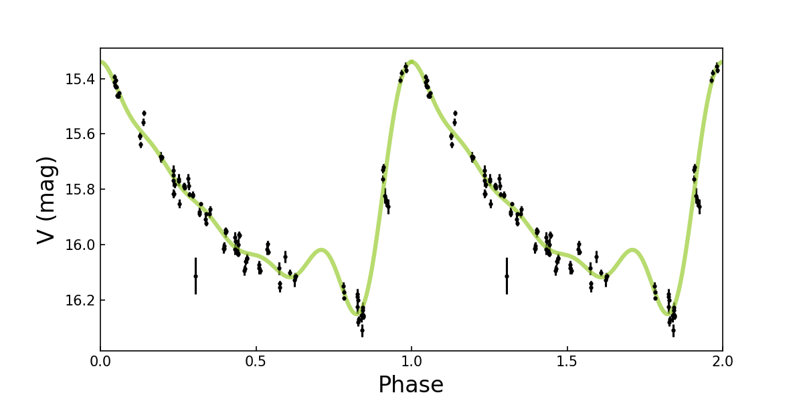

# Period-determination and Identification Pipeline Suite (PIPS)


[](https://dev.azure.com/PIPS-developers/PIPS/_build/latest?definitionId=1&branchName=master)
[](https://codecov.io/gh/SterlingYM/PIPS)
[](https://pips.readthedocs.io/en/latest/?badge=latest)

PIPS is a pipeline suite designed for analysis of variable lightcurves of astronomical objects. PIPS was originally developed solely to determine the periods of RR Lyrae variable stars but has grown into a suite that can detect periods of variable stars accurately, precisely, and rapidly while offering several other features for variable star anaylsis. With this suite one can determine periods through several different methods, analyze the morphology of lightcurves via fourier analysis, and determine stellar properties based off of preexisting stellar models. Currently our team is also exploring the possibility of using this pipeline to detect periods of exoplanets as well. 

(last edit: February 15th 2021) 



--------------------------
## Developers

* Head developer: [Yukei S. Murakami](https://www.fromthecalmsea.com) (sterling.astro@berkeley.edu)
* Developers: [Arjun Savel](https://www.arjunsavel.com) (asavel@umd.edu), [Andrew Hoffman]() (andrew@hoffman.aero), [James Sunseri](https://sites.google.com/view/jamessunseri/home) (jamessunseri@berkeley.edu)

--------------------------
## Publications
Please cite the following if PIPS is utilized for a scientific project:
* Hoffman et al. 2021 [](https://doi.org/10.1093/mnras/stab010) (arxiv: [2008.09778](https://arxiv.org/abs/2008.09778))
* Murakami et al. (Paper in prep, Arxiv link pending)


--------------------------
## Dependencies
* python (>=3.7)
* numpy
* scipy
* matplotlib
* time
* astropy
* ~~seaborn~~


--------------------------
## Usage (ver 0.3.0)

1. ```$ git clone https://github.com/SterlingYM/PIPS```
2. ```$ cd PIPS```
4. ```$ jupyter notebook```
5. Start a new Python notebook. In a jupyter cell, run the following:
```python
import PIPS

# data preparation -- create [time,mag,mag_err] list
data = PIPS.data_readin_LPP('sample_data/005.dat',filter='V')
phot_obj = PIPS.photdata(data)

# period detection
star.get_period(multiprocessing=False)

# generate best-fit light curve
x_th,y_th = star.get_bestfit_curve()

# plot light curve
star.plot_lc()
plt.plot(x_th/star.period,y_th,c='yellowgreen',lw=3,alpha=0.7) # x-axis normalized to unitless phase
plt.plot(x_th/star.period+1,y_th,c='yellowgreen',lw=3,alpha=0.7)
```

Sample data credit: UCB SNe Search Team (Filippenko Group)

